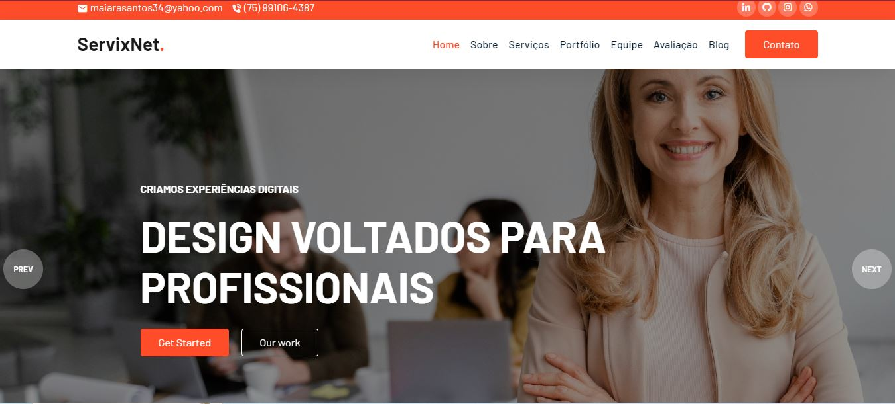

# <i>PROJETO LANDING PAGE BOOTSTRAP</i>

#

### 
 [Acesse aqui](https://landingpage-boot.netlify.app/)

 

#

O que fazer?

📌 Planejamento:
Uma landing page usando Bootstrap pode envolver a promoção de um produto ou serviço. Antes de começar, pense em por que você está criando essa página e para qual público.

📌 Conteúdo:
Decida o que você quer colocar na página, como texto, imagens e formulários.

📌 Layout:
Escolha um design que pareça legal e organize de uma forma clara.

📌 Bootstrap:
Use o Bootstrap para ajudar a construir a página. Ele oferece muitas ferramentas úteis e facilita o trabalho.

📌 Teste:
Verifique se a página funciona bem em diferentes tipos de dispositivos, como celulares e computadores.

# Features
- Fully Responsive
- Mobile Navigations
- Animated elements on scroll
- Smooth scrolling in each section.
- Sticky Navigation on scrolling
- and more ..

# Credit
- https://fonts.google.com/
- https://line-awesome.com/
- https://unsplash.com/
- https://michalsnik.github.io/aos/

# Watch more
For more videos visit to my YouTube channel. [SA7MAN](https://www.youtube.com/c/SA7MAN)

